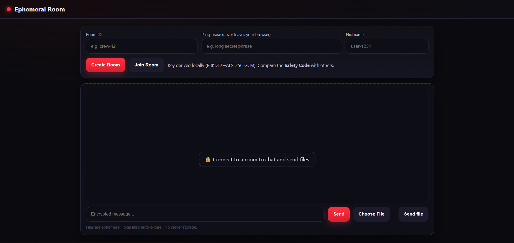
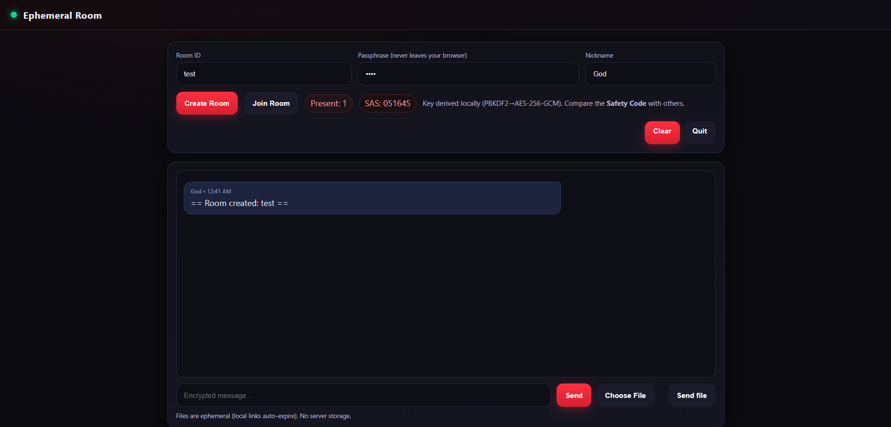

# Ephemeral Room

A privacy-focused, ephemeral chat and file sharing app using end-to-end encryption and WebRTC peer-to-peer channels. No server-side storage, no tracking, and strong security by default.

## Features
End-to-end encrypted messages and files
Peer-to-peer (WebRTC) direct transfer when possible
Fallback encrypted relay via server (no storage)
Ephemeral file links (auto-expire locally)
No account, no tracking, no clear metadata
Modern UI, mobile-friendly

## Screenshots



## Security
- All messages and files are encrypted in the browser using AES-256-GCM
- Passphrase never leaves your device
- Safety code (SAS) for out-of-band verification
- No nicknames or metadata sent in clear
- Strict HTTP headers (CSP, COOP, CORP, HSTS, etc.)
- Rate-limiting and anti-spam on server
- No server-side file or message storage

## Installation

### Prerequisites
- Node.js (v18+ recommended)

### Steps
1. Clone the repository:
   ```sh
   git clone https://github.com/yarrow18/ephemeral-room.git
   cd ephemeral-room
   ```
2. Install dependencies:
   ```sh
   npm install
   ```
3. (Optional) Generate self-signed certificates for HTTPS:
   ```sh
   mkdir certs
   openssl req -x509 -newkey rsa:4096 -keyout certs/server.key -out certs/server.crt -days 365 -nodes -subj "/CN=localhost"
   ```
4. Start the server:
   ```sh
   node server.js
   ```
5. Open your browser at [https://localhost:8443](https://localhost:8443) (or http://localhost:3000 if no certs)

## Usage
1. Enter a Room ID, Passphrase, and Nickname.
2. Click "Create Room" or "Join Room".
3. Share the Room ID and Passphrase with others (out-of-band).
4. Compare the Safety Code (SAS) with other participants for verification.
5. Chat and send files securely. Files are never stored on the server and links auto-expire.

## How It Works
- When you join or create a room, a cryptographic key is derived from your passphrase using PBKDF2.
- Messages and files are encrypted locally before sending.
- If a WebRTC peer-to-peer channel is available, data is sent directly.
- If not, data is relayed via the server, still encrypted (server cannot decrypt).
- No message or file is ever stored on the server.
- File download links are temporary and auto-expire after 10 minutes.

## Project Structure
```
private-chat/
├── server.js         # Node.js/Express/Socket.IO server
├── package.json      # Dependencies
├── certs/            # SSL certificates (optional)
├── public/
│   ├── index.html    # Main UI
│   └── client.js     # Client-side logic
```

## License
MIT

---
Feel free to contribute or open issues for suggestions and improvements.
